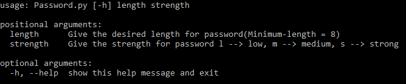
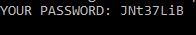
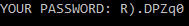
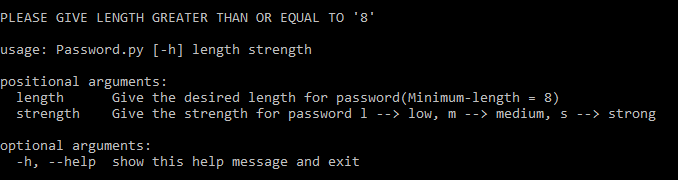
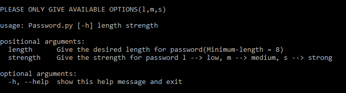

# PassGen

PassGen is a simple random password generator tool.

## Installation

Use the package manager pip to install requirements or dependencies. 

```bash
>> pip3 install -r requirements.txt
```
Then to run the tool
```python
>> python Password.py -h
```
Output:





## Usage
--------Low Strength---------
```
>> python Password.py 8 l
```
Output:


------Medium Strength-------
```
>> python Password.py 8 m
```
Output:





----------High Strength-------
```
>> python Password.py 8 s
```
Output:





## Error Output
1. Input of length less than 8
```python
>> python Password.py 7 l
```
Output:





2. Not giving Available Strength Options
```python
python Password.py 8 k
```
Output:



